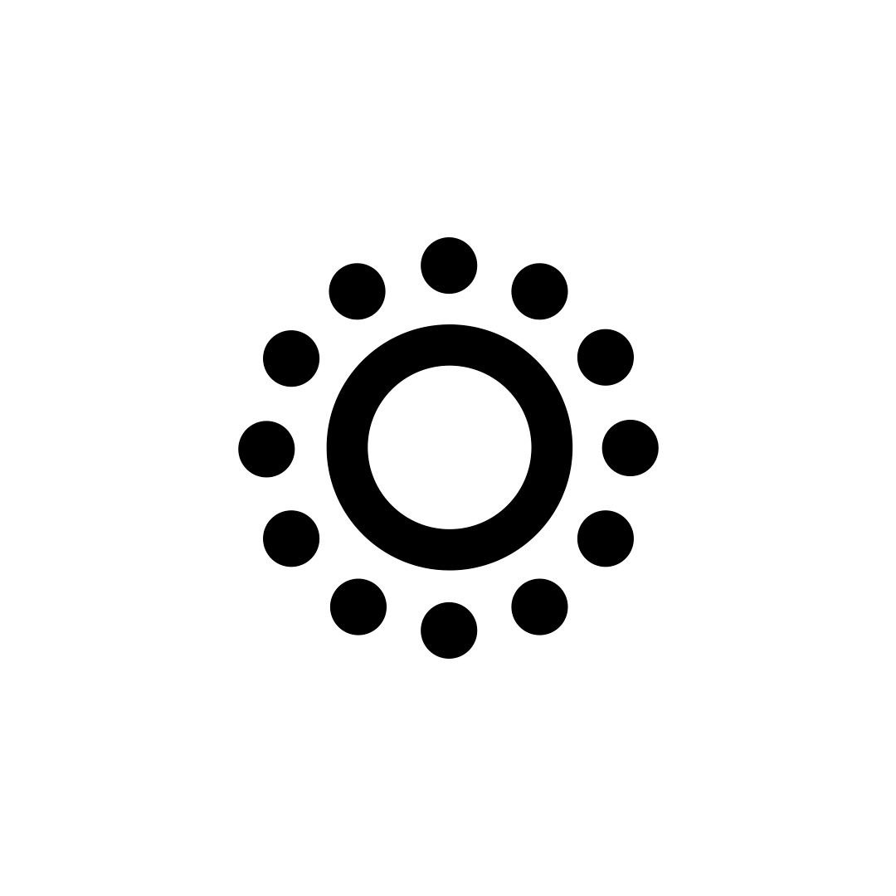

```go

func main() {

  	router := http.NewServeMux()

	router.HandleFunc("/", func(w http.ResponseWriter, r *http.Request) {
		json.NewEncoder(w).Encode(map[string]interface{}{
			"message": "Hey, soy Eliezer",
		})
	})

	http.ListenAndServe(":8080", router)
}

```


<div align="center" style="width: 100%; text-align: center; font-size: 18px;  margin-top: 20px; margin-bottom: 20px">
<p style="font-size: 12px; margin: 0;text-align: center"> GET / </p>
<h2 style="text-align: center">Hey, soy Eliezer</h2>
</div>

<div align="center" style="display:flex; gap: .25rem; justify-content: center; flex-wrap: wrap; margin-block: 1rem">


    


    


                


</div>

<!-- 
 -->

#### También puedes encontrarme en
[](https://www.linkedin.com/in/ttmday)

#### Algunos de mis proyectos actuales
<a title="Gogh Creative Page" target="_blank" href="https://gogh.flippoapp.com">

</a>
<a title="Shurupitos App" target="_blank" href="https://play.google.com/store/apps/details?id=com.gogh.shurupitos">

</a>
